# System Map

Visual architecture and data flow for Agent Factory.

---

## High-Level Architecture


---

## 4-Route Orchestration Flow


---

## KB Gap Logging Flow (Phase 1 - DEPLOYED)

```mermaid
sequenceDiagram
    participant User
    participant Bot as Telegram Bot
    participant Orch as RivetOrchestrator
    participant RAG as RAG Layer
    participant Logger as KBGapLogger
    participant DB as kb_gaps table
    participant LLM as Groq Fallback

    User->>Bot: "Siemens G120 F0003 fault"
    Bot->>Orch: route_query()
    Orch->>RAG: search_docs()
    RAG-->>Orch: 0 atoms found
    Orch->>Orch: Route C decision

    Orch->>Logger: log_gap(query, intent, filters)
    Logger->>DB: Check if gap exists (within 7 days)
    alt Gap exists
        DB-->>Logger: gap_id=1, frequency=1
        Logger->>DB: UPDATE frequency=2
    else New gap
        DB-->>Logger: No match
        Logger->>DB: INSERT new gap
    end
    Logger-->>Orch: gap_id returned

    Orch->>LLM: Generate fallback response
    LLM-->>Orch: AI-generated answer
    Orch-->>Bot: RivetResponse (confidence=0.5)
    Bot-->>User: "🤖 AI Generated (no KB match)"

    Note over Logger,DB: Gap logged for Phase 2<br/>research prioritization
```



---

## Research Pipeline Integration (Phase 2 - PLANNED)

```mermaid
sequenceDiagram
    participant User
    participant Orch as RivetOrchestrator
    participant Logger as KBGapLogger
    participant Research as ResearchPipeline
    participant Scraper as Forum/PDF Scraper
    participant Queue as Redis Queue
    participant Worker as Ingestion Worker
    participant DB as PostgreSQL

    User->>Orch: "Siemens G120 F0003 fault"
    Orch->>Logger: log_gap() → gap_id=1

    Note over Orch,Research: Phase 2: Auto-trigger research
    Orch->>Research: run(intent, gap_id=1)
    Research->>Scraper: search_forums()
    Scraper-->>Research: 3 sources found
    Research->>Queue: queue_ingestion(urls, gap_id=1)
    Research-->>Orch: research_status: 3 sources queued

    Note over Queue,Worker: Background processing
    Worker->>Queue: fetch_job()
    Worker->>Worker: extract_content()
    Worker->>Worker: generate_atoms()
    Worker->>DB: save_atoms(atom_ids=[a1,a2,a3])
    Worker->>Logger: mark_resolved(gap_id=1, atom_ids)

    Note over User,DB: Next query gets KB-sourced answer
    User->>Orch: "Siemens G120 F0003 fault" (again)
    Orch->>DB: search_docs()
    DB-->>Orch: 3 atoms found
    Orch-->>User: "📚 Knowledge Base (3 matches)"
```



---

## Database Schema (Key Tables)

### knowledge_atoms
- **Purpose:** Stores all knowledge base content with embeddings
- **Rows:** 1,964 atoms
- **Key Fields:**
  - `atom_id` (VARCHAR PRIMARY KEY)
  - `title`, `content`, `summary` (TEXT)
  - `vendor`, `equipment_type` (VARCHAR)
  - `embedding` (VECTOR(1536)) - OpenAI embeddings
  - `source_url`, `source_type` (VARCHAR)
  - `created_at`, `updated_at` (TIMESTAMP)

### kb_gaps (NEW - Phase 1)
- **Purpose:** Track queries with no KB coverage for research prioritization
- **Rows:** 0 (deployed but not tested yet)
- **Key Fields:**
  - `id` (SERIAL PRIMARY KEY)
  - `query` (TEXT) - Original user query
  - `intent_vendor`, `intent_equipment`, `intent_symptom` (VARCHAR/TEXT)
  - `search_filters` (JSONB) - Filters used in KB search
  - `triggered_at`, `last_asked_at` (TIMESTAMP)
  - `frequency` (INT DEFAULT 1) - Increments for duplicates within 7 days
  - `resolved` (BOOLEAN DEFAULT FALSE)
  - `resolved_at` (TIMESTAMP)
  - `resolution_atom_ids` (TEXT[]) - Atoms that resolved this gap

### source_fingerprints
- **Purpose:** Deduplication for research pipeline
- **Key Fields:**
  - `url_hash` (VARCHAR PRIMARY KEY)
  - `url`, `source_type` (VARCHAR)
  - `ingested_at` (TIMESTAMP)

### research_staging
- **Purpose:** Queue for sources being researched
- **Key Fields:**
  - `id` (SERIAL PRIMARY KEY)
  - `url`, `source_type` (VARCHAR)
  - `status` (VARCHAR) - pending/processing/completed/failed
  - `metadata` (JSONB)
  - `queued_at`, `processed_at` (TIMESTAMP)

---

## Multi-Provider Database Failover


**Failover Order:**
1. Neon (primary) - Connection pools, 5s timeout
2. Supabase (failover) - Activates if Neon fails
3. Railway (secondary) - Credentials incomplete, skipped

---

## LLM Router - Cost Optimization


**Cost Reduction:** 73% in live testing ($750/mo → $198/mo)

---

## VPS Deployment Architecture


**Service Management:**
```bash
# Check status
ssh vps "systemctl status orchestrator-bot"

# View logs
ssh vps "journalctl -u orchestrator-bot -f"

# Restart
ssh vps "systemctl restart orchestrator-bot"
```

---

## Data Flow: User Query → Response

```
1. User sends Telegram message → Bot receives
2. Bot → Orchestrator.route_query()
3. Orchestrator → Intent Detection (vendor, equipment, symptom)
4. Orchestrator → RAG Layer (search_docs with filters)
5. RAG → PostgreSQL (hybrid search: keyword + semantic)
6. PostgreSQL → RAG (returns N atoms)
7. RAG → Orchestrator (atoms + coverage level)
8. Orchestrator → Route Decision:
   - Route A (8+ atoms, strong): Call SME Agent
   - Route B (1-7 atoms, thin): Call SME + flag enrichment
   - Route C (0 atoms): Groq LLM + Log KB Gap (NEW)
   - Route D (unclear): Groq LLM clarification
9. SME/LLM → Generate response
10. Orchestrator → ResponseFormatter (citations, warnings)
11. Orchestrator → Bot
12. Bot → Telegram API → User receives message
```

**New in Phase 1 (KB Gap Logging):**
- Step 8c: When Route C triggered → KBGapLogger.log_gap()
- Logger checks if query seen within 7 days
- If yes: increment frequency
- If no: create new gap record
- Return gap_id to orchestrator

---

## Technology Stack

### Core
- **Language:** Python 3.10+
- **Orchestration:** LangGraph, LangChain
- **Database:** PostgreSQL (pgvector), psycopg3
- **Caching:** Redis (research queue)

### LLM Providers
- **Primary Fallback:** Groq (Llama 3.1 70B, FREE)
- **Secondary Fallback:** OpenAI (GPT-3.5-turbo, GPT-4o)
- **Embeddings:** OpenAI (text-embedding-3-small, 1536 dims)

### Infrastructure
- **Bot:** python-telegram-bot
- **VPS:** Hostinger (72.60.175.144)
- **Service Manager:** systemd
- **Database Hosts:** Neon (primary), Supabase (failover)
- **Deployment:** Manual SSH + git pull

### Development
- **Package Manager:** Poetry
- **Testing:** pytest
- **Git Workflow:** Worktrees for parallel development
- **Documentation:** Markdown + Mermaid diagrams

---

## Component Status Legend

| Symbol | Meaning |
|--------|---------|
| ✅ | Working in production |
| 🔄 | Partially working (needs integration) |
| ❌ | Broken / Not implemented |
| ⏳ | Planned / In progress |
| 🆕 | New in this session |

---

**Last Updated:** [2025-12-22 23:45]
